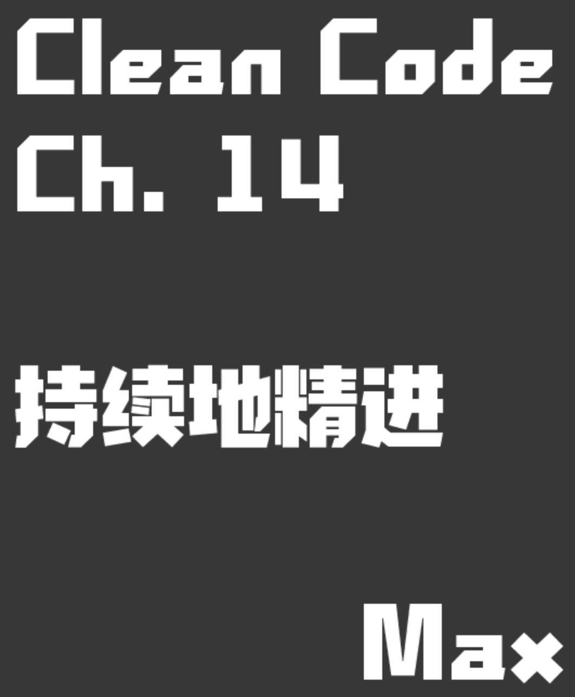

# Clean Code 第14章 - 持續地精進

## 000.

- 本章約為60頁
- 大多數都是代碼示例
- 全篇的成品代碼示例和再試圖解釋寫臟代碼，TDD與重構，並使其成為清潔的過程
- 示例看起來像簡單的解析器類，將字符串數組作為參數並對其進行解析以生成與業務需要string
- 編寫器還實現了特殊的ArgsException來處理異常

> 有可能先從骯髒的代碼開始，然後再清理它。這裡是必須清潔的步驟！

## 001.

- 解析器能夠支持布爾值是簡單且易於理解的
- 但是其設計不是很好。當程序員添加功能來解析String，integer和其他值時，示例似乎就像是一個具有很多功能的非常大的類。它很難理解和維護，我們稱之為錯誤代碼。
- 停止添加新功能並開始重構，這一點很重要，有一個工作不良的代碼，程序員覺得代碼充滿了混亂。
- 重構可能導致崩潰或破壞功能。他說，要避免這種情況，我們需要TDD。

> 總是嘗試確保測試通過並始終保持系統運行

> 清理示例的方法只是分而治之，使其簡單並易於添加新功能。關注點的分離使代碼更易於理解和維護。

> 羅伯特·馬丁（Robert Martin）不同意關於時間限制的觀點

- 從長遠來看，沒有什麼比糟糕的代碼更糟糕
- 不良的團隊合作精神，不良的日程表可以修復所有問題，但可能無法修復不良的代碼。
- TDD使我們的代碼更具可維護性，更易於理解。

> TDD與乾淨代碼之間存在著夥伴關係

## 總結

# 參考資料

- https://medium.com/@dnkilic/clean-code-chapter-14-successive-refinement-f16d541adaa
- http://gdut_yy.gitee.io/doc-cleancode/ch14.html
- https://github.com/adjerbetian/clean-code-14-successive-refinement-typescript/tree/0-init
